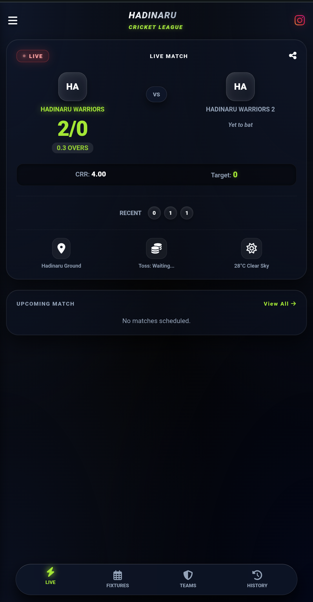
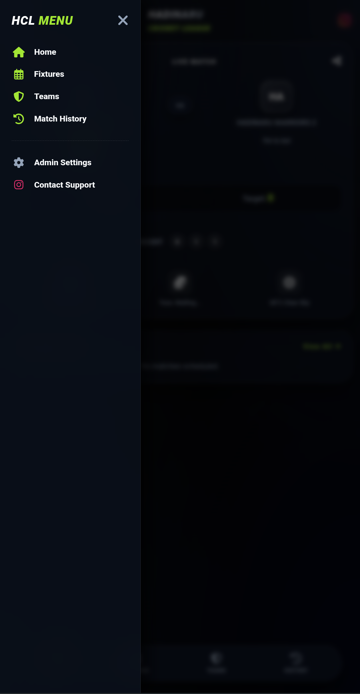
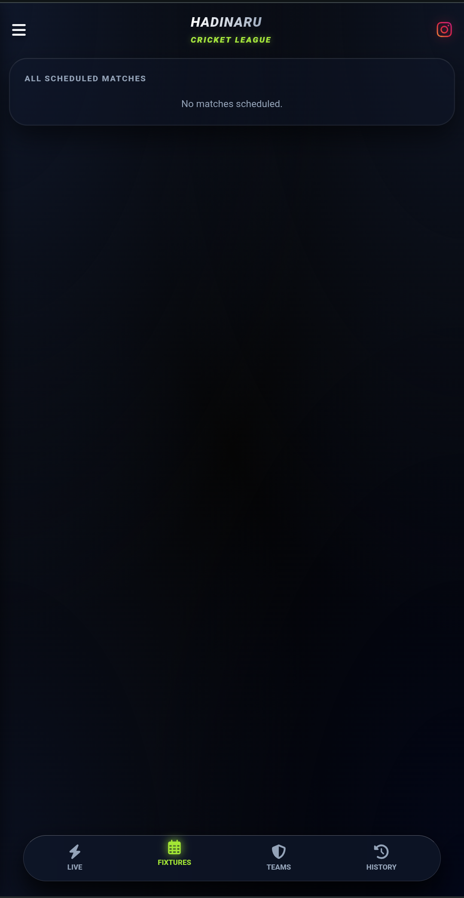

# Cricketpro
#pythonanywhere wsgi con
import sys
import os

# 1. Path to your project folder
path = '/home/username/project_foldername'
if path not in sys.path:
    sys.path.insert(0, path)

# 2. Import your Flask app
# This looks for 'app' inside a file named 'app.py'
# python file name must be app.py
from app import app as application


# explenation
# 🏏 Cricket-16 Live Scoring Dashboard

A real-time, ultra-fast cricket scoring and tournament management dashboard. Built to track live matches, maintain points tables, and broadcast ball-by-ball updates instantly to all connected viewers.

## 📖 About the Website

Cricket-16 is designed to be the ultimate companion for local cricket tournaments. Instead of using pen and paper or slow scoring apps, this platform allows an admin to update scores with a single tap, which immediately updates the screens of anyone watching the website in real-time. It handles everything from live runs and wickets to Net Run Rate (NRR) calculations and complete match history.

## ✨ Key Features

* **🔴 Live Match Tracking:** Real-time updates for runs, wickets, overs, and current batting/bowling teams.
* **⚡ Live Broadcasting (WebSockets):** Instant score updates pushed to all connected clients without needing to refresh the page.
* **🏆 Tournament Management:** Keep track of participating teams, upcoming matches, and a dynamically updating Points Table.
* **📖 Match History:** Automatically archives completed matches with full results and score summaries.
* **🛠️ Admin Panel:** A secure control room to update scores, end innings, setup new matches, and manage teams.
* **💾 Lightweight Database:** Uses a fast, file-based JSON architecture (`cricket_db.json`) for zero-setup database management.

## 🛠️ Tech Stack

* **Backend:** Python, FastAPI
* **Real-time Engine:** WebSockets & Short Polling
* **Frontend:** HTML, CSS, JavaScript (Glass UI)
* **Server/Deployment:** Uvicorn, a2wsgi (Hosted on PythonAnywhere)

## 🚀 Local Installation & Setup

1. **Clone the repository:**
   ```bash
   git clone <your-github-repo-url>
   cd Cricket-16

2. Install the dependencies:
Ensure you have Python installed, then run:
pip install -r requirements.txt

3.Run the local server:
python app.py

# admin access 
1. 🔒 Admin Access
To control the live match and manage the tournament, navigate to the Admin Panel:
URL: /login
Default Password: (contact author)

# deployed in vercel 
https://cricketpro-ruddy.vercel.app/.

main 🙄 website hosted link plz visit here


# Connect With Me

Instagram: https://instagram.com/__suman._.007

GitHub: https://github.com/Suman-11-web


# Screenshots

## Homepage


## Menu Bar


## Scheduled Page

   
